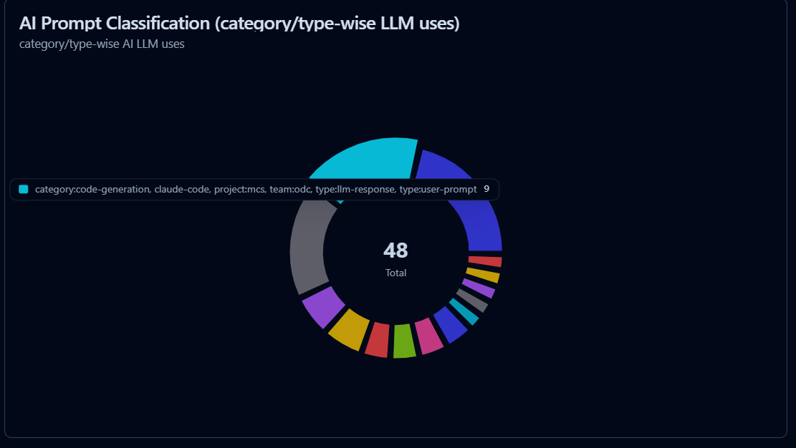
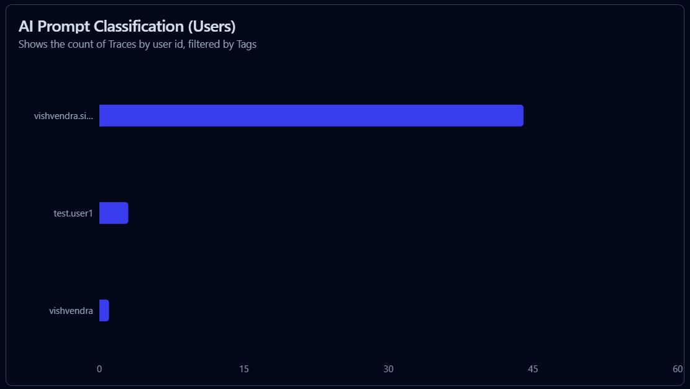
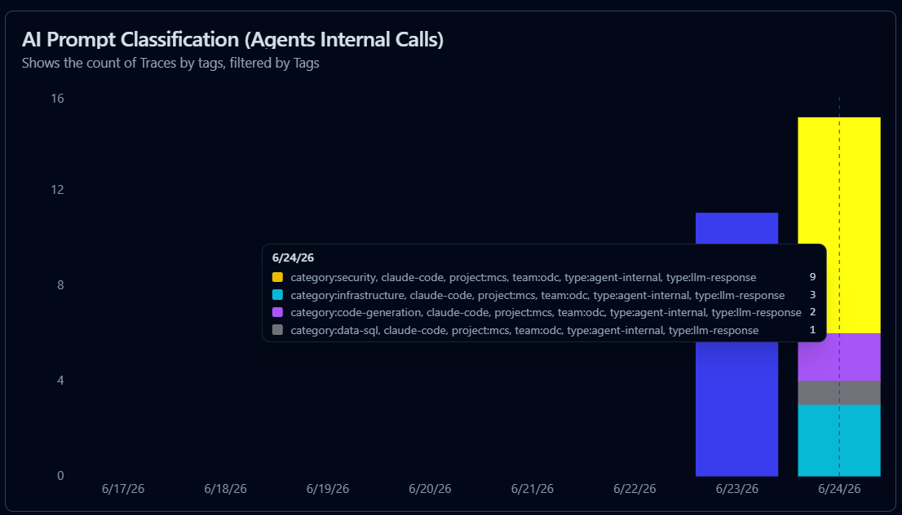
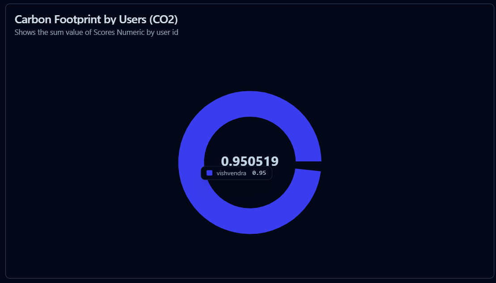
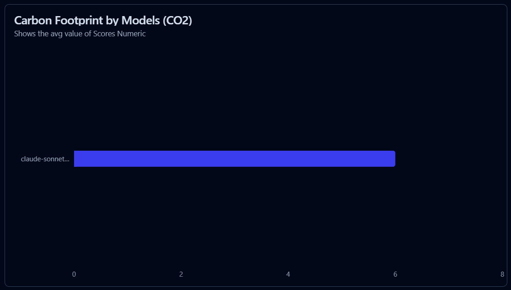

# Fred Observability Stack

> End-to-end LLM observability for AI Agents workflows — prompt classification, carbon footprint tracking, and live Langfuse dashboards.

[](https://www.python.org/)
[](https://langfuse.com/docs)
[](LICENSE)
[](https://claude.ai/code)

---

## Overview

The **Fred Observability Stack** adds a lightweight observability layer on top of [Langfuse](https://langfuse.com) to give engineering teams complete visibility into how AI assistants (Claude Code, agent pipelines, LLM apps) are being used day-to-day.

Two standalone Python scripts instrument every LLM interaction without requiring SDK changes or code modifications:

| Script | What it does |
|---|---|
| `langfuse_prompt_classify.py` | Auto-classifies traces with `category:*` and `type:*` tags for dashboard filtering |
| `langfuse_carbon.py` | Calculates kg CO₂ per LLM call and pushes scores to Langfuse for sustainability tracking |

Both scripts run against a live Langfuse instance (self-hosted or cloud) and are safe to run repeatedly — duplicate writes are always skipped.

---

## Features

### Prompt Classification
- **11 built-in categories** — `security`, `infrastructure`, `cicd-devops`, `debugging`, `testing`, `code-review`, `requirements-analysis`, `documentation`, `data-sql`, `code-generation`, `general-chat`
- **3-tag taxonomy** per trace: `category:*` (topic), `type:user-prompt` / `type:agent-internal` / `type:llm-response` (origin)
- **Multi-field extraction** — handles plain text, structured `{role, content}` messages, multi-turn conversation arrays, and agent XML payloads
- **Idempotent** — already-classified traces are skipped; partial classifications are completed
- **Dry-run mode** — preview all changes before writing a single tag
- **Paginated fetch** — handles large trace volumes with built-in rate limiting

### Carbon Footprint Tracking
- **Model-aware CO₂ factors** — separate emission rates for Haiku, Sonnet, Opus families
- **Token-level granularity** — one `carbon_kg` score per GENERATION observation
- **Langfuse score integration** — scores queryable via dashboards, filterable by model, user, session
- **Equivalence reporting** — km driven, km flown, kWh consumed, USD API cost
- **Monthly & per-user breakdown** in the terminal report
- **Duplicate prevention** — existing `carbon_kg` scores are detected and skipped

---

## Quick Start

### Prerequisites

- Python 3.9+
- A running [Langfuse](https://langfuse.com/docs/deployment/self-host) instance (default: `http://localhost:3001`)
- LLM traces already captured in Langfuse (via Claude Code telemetry, SDK, or OTEL)

### Installation

```bash
# Clone the repository
git clone https://github.com/fred-agent/fred-observability-stack.git
cd fred-observability-stack

# No additional dependencies — uses Python standard library only
python3 --version  # 3.9+ required
```

### Configure credentials

Set environment variables or accept the built-in defaults for a local Langfuse instance:

```bash
export LANGFUSE_BASE_URL="http://localhost:3001"
export LANGFUSE_PUBLIC_KEY="pk-lf-..."
export LANGFUSE_SECRET_KEY="sk-lf-..."
```

### Run in 60 seconds

```bash
# Preview prompt classifications for the last 24 hours (no writes)
python3 langfuse_prompt_classify.py --hours 24 --dry-run

# Apply classifications
python3 langfuse_prompt_classify.py --hours 24

# View carbon report for the last 24 hours
python3 langfuse_carbon.py --hours 24 --report

# Push carbon scores to Langfuse
python3 langfuse_carbon.py --hours 24 --push-scores
```

---

## Feature 1 — Prompt Classification

Automatically classifies every LLM trace in Langfuse with up to three tags that answer two questions: **who sent it** and **what topic it covers**.

### The 3-Tag Taxonomy

```
category:*          → WHAT topic (infrastructure, debugging, code-review, …)
type:user-prompt    → WHO sent it (a human typed this)
type:agent-internal → WHO sent it (agent or system injected this)
type:llm-response   → WHAT came back (the LLM responded to this trace)
```

Every trace receives a `category:*` tag and one or more `type:*` tags. This gives you clean dashboard dimensions for filtering, grouping, and cost attribution.

### Classification Categories

| Tag | Keywords matched |
|---|---|
| `category:security` | vulnerability, CVE, JWT, RBAC, TLS, OWASP, encrypt, pentest, … |
| `category:infrastructure` | terraform, kubernetes, docker, prometheus, GCP, helm, … |
| `category:cicd-devops` | pipeline, deploy, github action, rollout, artifact, … |
| `category:debugging` | fix, bug, error, traceback, crash, root cause, … |
| `category:testing` | pytest, jest, mock, coverage, TDD, e2e, vitest, … |
| `category:code-review` | review, refactor, lint, simplify, readable, optimise, … |
| `category:requirements-analysis` | requirement, user story, architecture, feasibility, … |
| `category:documentation` | document, README, docstring, summarize, changelog, … |
| `category:data-sql` | SQL, query, postgres, BigQuery, dbt, ETL, pandas, … |
| `category:code-generation` | write, create, generate, implement, scaffold, endpoint, … |
| `category:general-chat` | hi, hello, thanks, what is, can you, tell me, … |
| `category:agentic-calls` | dedicated bucket for all agent-internal traces |
| `category:uncategorised` | no keyword matched |

### Dashboard — Live Classification View

The Langfuse dashboard shows real-time breakdowns by category and type. Filter by tag to drill into specific usage patterns across your team.







### Usage

```bash
# Preview classifications — no writes
python3 langfuse_prompt_classify.py --hours 24 --dry-run

# Classify and apply tags
python3 langfuse_prompt_classify.py --hours 24

# Classify last 7 days
python3 langfuse_prompt_classify.py --hours 168

# Run hourly via cron (idempotent)
0 * * * * cd /path/to/stack && python3 langfuse_prompt_classify.py >> classify.log 2>&1
```

### Sample Output

```
=================================================================
  Langfuse Prompt Classifier v2.0
  Base URL    : http://localhost:3001
  Window      : Last 24 hour(s)
  Categories  : 11 defined
=================================================================
  Fetching traces since 2026-06-23T07:22:41Z ...
  Page 1/1 — fetched 39 traces

  6bd8bfa6...  type=agent-internal   cat=security         prompt='cat > /tmp/...'
  58a159c9...  type=user-prompt      cat=code-review      prompt='python3 langfuse_carbon.py ...'
  b6e8a320...  type=user-prompt      cat=code-generation  prompt='python3 langfuse_carbon.py ...'

  Skipped (already fully classified): 6
  To update: 33   → Done — successes: 33  errors: 0

=================================================================
  PROMPT CLASSIFICATION REPORT — Last 24h
=================================================================

  ── Type Breakdown -----------------------------------
  llm-response      39   50.0%  █████████████████████████
  user-prompt       21   26.9%  █████████████████████
  agent-internal    18   23.1%  ██████████████████

  ── Category Breakdown -------------------------------
  security          11   28.2%  ███████████
  code-generation   11   28.2%  ███████████
  infrastructure     4   10.3%  ████
  general-chat       3    7.7%  ███
  agentic-calls      3    7.7%  ███
  code-review        2    5.1%  ██
  data-sql           2    5.1%  ██
  documentation      1    2.6%  █

  TOTAL             39
=================================================================
```

---

## Feature 2 — Carbon Footprint Tracking

Translates raw LLM token counts into CO₂ equivalent emissions using model-specific energy factors, then persists them as Langfuse scores for dashboard querying and sustainability reporting.

### How CO₂ is Calculated

```
CO₂ (kg) = (total_tokens / 1,000,000) × model_factor
```

| Model family | Factor (kg CO₂ / 1M tokens) |
|---|---|
| Claude Haiku 4.5 | 0.27 |
| Claude Sonnet 4.6 | 0.58 (default) |
| Claude Opus 4.8 | 1.15 |
| Claude 3.5 Sonnet | 0.58 |
| Claude 3 Haiku | 0.28 |

> Factors are engineering estimates based on Anthropic's inference energy profile. They are not audited for ESG reporting purposes.

### Energy Equivalences

Each report includes real-world equivalences to make CO₂ numbers tangible:

- **km driven** — petrol car at ~0.21 kg CO₂/km
- **km flown** — economy class at ~0.115 kg CO₂/km
- **kWh** — energy at 2.5 Wh per 1K tokens
- **USD** — API cost from Langfuse `calculatedTotalCost`

### Dashboard — Carbon Score View

Carbon scores appear as numeric Langfuse scores tagged per observation. Use the Scores widget in your Langfuse dashboard to track carbon trends over time, by model or by user.

**Dashboard widget settings:**
```
View    → Scores
Metric  → Average (or Sum for totals)
Name    → carbon_kg
```





### Usage

```bash
# Terminal report — no writes to Langfuse
python3 langfuse_carbon.py --hours 24 --report

# Push carbon_kg scores to Langfuse
python3 langfuse_carbon.py --hours 24 --push-scores

# Preview what would be pushed (dry run)
python3 langfuse_carbon.py --hours 24 --push-scores --dry-run

# Report AND push in one command
python3 langfuse_carbon.py --hours 24 --report --push-scores

# Filter by specific user
python3 langfuse_carbon.py --hours 24 --push-scores --user vishvendra.singh

# Last 30 days (default window)
python3 langfuse_carbon.py --push-scores
```

### Sample Output

```
╔═════════════════════════════════════════════════════════════════╗
║  🌱 Carbon Footprint Report — All Users                        ║
║  Last 1 day(s)                                                  ║
╠═════════════════════════════════════════════════════════════════╣
║                                                                 ║
║   0.003 kg CO₂                                                  ║
║   8.6K tokens consumed across 5 LLM calls                      ║
║                                                                 ║
╠═════════════════════════════════════════════════════════════════╣
║  Equivalences:                                                  ║
║   🚗       0.01 km driven (petrol car)                         ║
║   ✈️         0.03 km flown (economy)                            ║
║   ⚡       0.02 kWh estimated energy                           ║
║   💰   $  0.0347 API cost (Langfuse estimate)                  ║
╠═════════════════════════════════════════════════════════════════╣
║  By Model:                                                      ║
║   claude-sonnet-4-6     ██████████████████  0.002kg   3.7K tok ║
║   claude-haiku-4-5      ██████████░░░░░░░░  0.001kg   4.9K tok ║
╠═════════════════════════════════════════════════════════════════╣
║  By User:                                                       ║
║   vishvendra.singh      ██████████████████  0.003kg   7.9K tok ║
║   test.user1            ██░░░░░░░░░░░░░░░░  0.000kg    663 tok ║
╚═════════════════════════════════════════════════════════════════╝
```

---

## Architecture

```
┌──────────────────────────────────────────────────────────────┐
│  LLM Interactions                                            │
│  (Claude Code, SDK apps, OTEL instrumented services)        │
└────────────────────────┬─────────────────────────────────────┘
                         │  OTLP / Langfuse SDK
                         ▼
┌──────────────────────────────────────────────────────────────┐
│  Langfuse                          http://localhost:3001     │
│  ┌──────────────┐  ┌────────────┐  ┌──────────────────────┐ │
│  │   Traces     │  │ Generations│  │       Scores         │ │
│  │  (raw turns) │  │ (LLM calls)│  │  (carbon_kg scores)  │ │
│  └──────┬───────┘  └─────┬──────┘  └──────────┬───────────┘ │
└─────────┼────────────────┼────────────────────┼─────────────┘
          │                │                    ▲
          │ GET /traces    │ GET /observations  │ POST /scores
          │                │                    │
┌─────────▼────────────────▼────────────────────┴─────────────┐
│  Fred Observability Stack                                    │
│                                                              │
│  langfuse_prompt_classify.py        langfuse_carbon.py      │
│  ┌────────────────────────┐         ┌─────────────────────┐ │
│  │ 1. Fetch traces        │         │ 1. Fetch GENERATION  │ │
│  │ 2. Extract text        │         │    observations      │ │
│  │ 3. Detect type         │         │ 2. Sum token counts  │ │
│  │ 4. Keyword classify    │         │ 3. Apply CO₂ factor  │ │
│  │ 5. PATCH tags          │         │ 4. POST carbon_kg    │ │
│  └────────────────────────┘         └─────────────────────┘ │
└──────────────────────────────────────────────────────────────┘
          │                                    │
          ▼                                    ▼
   Tags on traces                     Numeric scores per
   (category:*, type:*)               observation (carbon_kg)
   → Dashboard filters                → Dashboard widgets
   → Usage analytics                  → Sustainability reports
```

---

## Configuration

### Environment Variables

| Variable | Default | Description |
|---|---|---|
| `LANGFUSE_BASE_URL` | `http://localhost:3001` | Langfuse instance URL |
| `LANGFUSE_PUBLIC_KEY` | _(built-in)_ | Project public key |
| `LANGFUSE_SECRET_KEY` | _(built-in)_ | Project secret key |

Override via shell export or a `.env` file:

```bash
export LANGFUSE_BASE_URL="https://cloud.langfuse.com"
export LANGFUSE_PUBLIC_KEY="pk-lf-your-key-here"
export LANGFUSE_SECRET_KEY="sk-lf-your-secret-here"
```

### Classifier Tuning

Open `langfuse_prompt_classify.py` and edit the `CATEGORIES` list to add or reorder keyword rules. Categories are matched in priority order — the first match wins.

```python
CATEGORIES: List[Tuple[str, List[str]]] = [
    ("category:security", [
        "vulnerability", "cve", "jwt", "rbac", "owasp", ...
    ]),
    ("category:infrastructure", [
        "terraform", "kubernetes", "docker", "helm", ...
    ]),
    # Add your own:
    ("category:my-team-topic", [
        "my-keyword", "another-keyword",
    ]),
    ...
]
```

Detection thresholds (for user-prompt vs. agent-internal classification):

```python
USER_PROMPT_MAX_CHARS    = 1000   # text longer than this → agent-internal
USER_PROMPT_MAX_TOKENS   = 300    # more tokens than this → agent-internal
USER_PROMPT_MAX_MESSAGES = 3      # more messages than this → agent-internal
```

### Carbon Factors

Update emission factors in `langfuse_carbon.py` to match your region or model pricing:

```python
CO2_FACTORS: Dict[str, float] = {
    "claude-haiku-4-5":    0.27,  # kg CO₂ per 1M tokens
    "claude-sonnet-4-6":   0.58,
    "claude-opus-4-8":     1.15,
    "default":             0.58,
}
```

---

## CLI Reference

### langfuse_prompt_classify.py

```
usage: langfuse_prompt_classify.py [--hours N] [--dry-run] [--report]

Options:
  --hours N    Look-back window in hours (default: 1)
  --dry-run    Preview tag changes without writing
  --report     Print classification summary report
```

### langfuse_carbon.py

```
usage: langfuse_carbon.py [--hours N] [--report] [--push-scores] [--user USER] [--dry-run]

Options:
  --hours N      Look-back window in hours (default: 720 = 30 days)
  --report       Print carbon report to terminal (default if no mode given)
  --push-scores  Write carbon_kg scores to Langfuse
  --user USER    Filter by userId
  --dry-run      Preview score writes without writing (requires --push-scores)
```

---

## Enabling Claude Code Telemetry

To capture Claude Code sessions in Langfuse, export these variables before starting a session:

```bash
export CLAUDE_CODE_ENABLE_TELEMETRY=1
export OTEL_METRICS_EXPORTER=otlp
export OTEL_LOGS_EXPORTER=otlp
export OTEL_TRACES_EXPORTER=otlp
export OTEL_EXPORTER_OTLP_ENDPOINT=http://localhost:4318
```

Your local observability stack (OpenTelemetry Collector → Langfuse) will receive traces automatically.

---

## Troubleshooting

**No traces found**
```bash
# Widen the window
python3 langfuse_prompt_classify.py --hours 720

# Verify connectivity
curl -u "$LANGFUSE_PUBLIC_KEY:$LANGFUSE_SECRET_KEY" \
     "$LANGFUSE_BASE_URL/api/public/traces?limit=1"
```

**All traces classified as `agentic-calls`**

This typically means the `input` field on your traces is empty or uses a format the extractor doesn't recognise. Run with default verbosity to see the `prompt=''` lines, then check the raw trace in the Langfuse UI to inspect the `input` payload.

**Carbon scores not appearing in Langfuse UI**

`--dry-run` only runs report mode. You must pass `--push-scores` to write to Langfuse:

```bash
# Correct: preview then push
python3 langfuse_carbon.py --hours 24 --push-scores --dry-run
python3 langfuse_carbon.py --hours 24 --push-scores
```

**401 Unauthorized errors**

Verify your keys match the project in Langfuse → Settings → API Keys. The public key starts with `pk-lf-` and the secret with `sk-lf-`.

---

## Use Cases

| Use Case | How |
|---|---|
| **Team usage analytics** | Filter dashboard by `type:user-prompt` + `category:*` to see what topics your team asks about most |
| **Cost attribution** | Group traces by `userId` + `category:*` to allocate LLM spend per team/topic |
| **Agentic vs. human traffic** | Compare `type:user-prompt` vs `type:agent-internal` ratio to understand automation overhead |
| **Security prompt auditing** | Filter `category:security` traces to review security-sensitive interactions |
| **Carbon / ESG reporting** | Push `carbon_kg` scores monthly and export from Langfuse for sustainability dashboards |
| **Model optimisation** | Identify `category:general-chat` traces running on expensive models and route to Haiku |

---

## Contributing

1. Fork the repository
2. Create a feature branch: `git checkout -b feature/my-feature`
3. Make changes — match the existing code style (pure stdlib, no dependencies)
4. Test against a local Langfuse instance with `--dry-run` before committing
5. Open a pull request with a description of the change and sample output

---

## Related Projects

- [Fred Agent](https://github.com/ThalesGroup/fred) — the AI assistant this stack instruments
- [Langfuse](https://langfuse.com) — the open-source LLM observability platform
- [Fred Observability Stack](https://github.com/fred-agent/fred-observability-stack) — this repository

---

## License

Apache 2.0 — see [LICENSE](LICENSE) for details.
